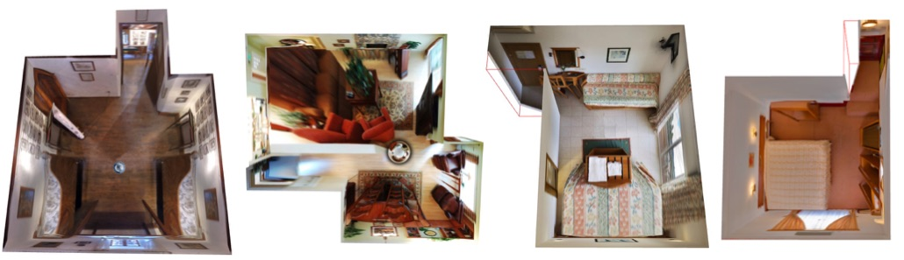
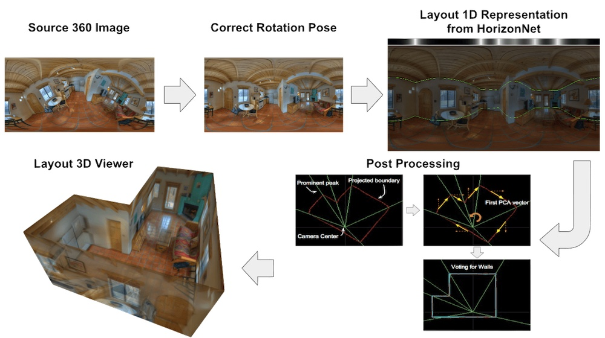
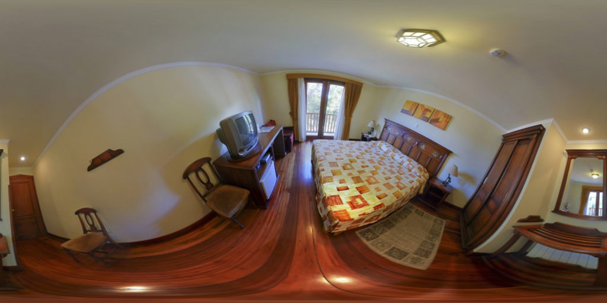
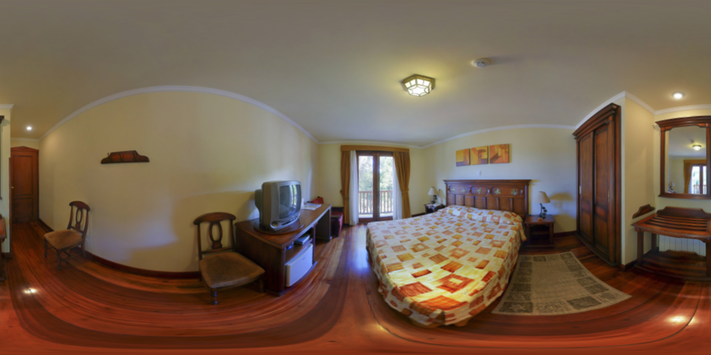
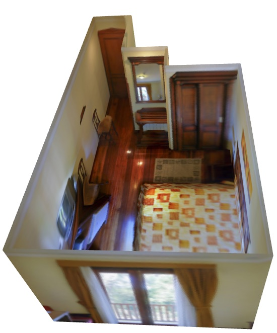

# HorizonNet

This is the implementation of our CVPR'19 "[
HorizonNet: Learning Room Layout with 1D Representation and Pano Stretch Data Augmentation](https://arxiv.org/abs/1901.03861)" ([project page](https://sunset1995.github.io/HorizonNet/)).

**News, June 15, 2019** - Critical bug fix for general layout (`dataset.py`, `inference.py` and `misc/post_proc.py`)\
**News, Aug 19, 2019** - Report results on [Structured3D dataset](https://structured3d-dataset.org/). (See [the report :clipboard: on ST3D](README_ST3D.md)).



This repo is a **pure python** implementation that you can:
- **Inference on your images** to get cuboid or general shaped room layout
- **3D layout viewer**
- **Correct pose** for your panorama images
- **Pano Stretch Augmentation** copy and paste to apply on your own task
- **Quantitative evaluatation** (3D IoU, Corner Error, Pixel Error)
    - cuboid shape
    - general shape
- **Your own dataset** preparation and training

**Method Pipeline overview**:


## Requirements
- Python 3
- pytorch>=1.0.0
- numpy
- scipy
- sklearn
- Pillow
- tqdm
- tensorboardX
- opencv-python>=3.1 (for pre-processing) (also can't be too new, the latest opencv removed a key algorithm due to patent, 3.1.0.5 works. )
- open3d>=0.7 (for layout 3D viewer)
- shapely
- torchvision


### Download
#### Dataset
- PanoContext/Stanford2D3D Dataset
    - [Download preprocessed pano/s2d3d](https://drive.google.com/open?id=1e-MuWRx3T4LJ8Bu4Dc0tKcSHF9Lk_66C) for training/validation/testing
        - Put all of them under `data` directory so you should get:
            ```
            HorizonNet/
            ├──data/
            |  ├──layoutnet_dataset/
            |  |  |--finetune_general/
            |  |  |--test/
            |  |  |--train/
            |  |  |--valid/
            ```
        - `test`, `train`, `valid` are processed from [LayoutNet's cuboid dataset](https://github.com/zouchuhang/LayoutNet).
        - `finetune_general` is re-annotated by us from `train` and `valid`. It contains  65 general shaped rooms.
- Structured3D Dataset
    - See [the tutorial](https://github.com/sunset1995/HorizonNet/blob/master/README_ST3D.md#dataset-preparation) to prepare training/validation/testing for HorizonNet.


#### Pretrained Models
- [resnet50_rnn__panos2d3d.pth](https://drive.google.com/open?id=1aieMd61b-3BoOeTRv2pKu9yTk5zEinn0)
    - Trained on PanoContext/Stanford2d3d 817 pano images.
    - Trained for 300 epoch
- [resnet50_rnn__st3d.pth](https://drive.google.com/open?id=16v1nhL9C2VZX-qQpikCsS6LiMJn3q6gO)
    - Trained on Structured3D 18362 pano images with setting of original furniture and lighting.
    - Trained for 50 epoch.
    - Select 50th epoch according to loss function on validation set.


## Inference on your images

In below explaination, I will use `assets/demo.png` for example.
-  (modified from PanoContext dataset)


### 1. Pre-processing (Align camera rotation pose)
- **Execution**: Pre-process the above `assets/demo.png` by firing below command.
    ```bash
    python preprocess.py --img_glob assets/demo.png --output_dir assets/preprocessed/
    ```
    - `--img_glob` telling the path to your 360 room image(s).
        - support shell-style wildcards with quote (e.g. `"my_fasinated_img_dir/*png"`).
    - `--output_dir` telling the path to the directory for dumping the results.
    - See `python preprocess.py -h` for more detailed script usage help.
- **Outputs**: Under the given `--output_dir`, you will get results like below and prefix with source image basename.
    - The aligned rgb images `[SOURCE BASENAME]_aligned_rgb.png` and line segments images `[SOURCE BASENAME]_aligned_line.png`
        - `demo_aligned_rgb.png` | `demo_aligned_line.png`
          :--------------------: | :---------------------:
           | 
    - The detected vanishing points `[SOURCE BASENAME]_VP.txt` (Here `demo_VP.txt`)
        ```
        -0.002278 -0.500449 0.865763
        0.000895 0.865764 0.500452
        0.999999 -0.001137 0.000178
        ```


### 2. Estimating layout with HorizonNet
- **Execution**: Predict the layout from above aligned image and line segments by firing below command.
    ```bash
    python inference.py --pth ckpt/resnet50_rnn__mp3d.pth --img_glob assets/preprocessed/demo_aligned_rgb.png --output_dir assets/inferenced --visualize
    ```
    - `--pth` path to the trained model.
    - `--img_glob` path to the preprocessed image.
    - `--output_dir` path to the directory to dump results.
    - `--visualize` optinoal for visualizing model raw outputs.
    - `--force_cuboid` add this option if you want to estimate cuboid layout (4 walls).
- **Outputs**: You will get results like below and prefix with source image basename.
    - The 1d representation are visualized under file name `[SOURCE BASENAME].raw.png`
    - The extracted corners of the layout `[SOURCE BASENAME].json`
        ```
        {"z0": 50.0, "z1": -59.03114700317383, "uv": [[0.029913906008005142, 0.2996523082256317], [0.029913906008005142, 0.7240479588508606], [0.015625, 0.3819984495639801], [0.015625, 0.6348703503608704], [0.056027885526418686, 0.3881891965866089], [0.056027885526418686, 0.6278984546661377], [0.4480381906032562, 0.3970482349395752], [0.4480381906032562, 0.6178648471832275], [0.5995567440986633, 0.41122356057167053], [0.5995567440986633, 0.601679801940918], [0.8094607591629028, 0.36505699157714844], [0.8094607591629028, 0.6537724137306213], [0.8815288543701172, 0.2661873996257782], [0.8815288543701172, 0.7582473754882812], [0.9189453125, 0.31678876280784607], [0.9189453125, 0.7060701847076416]]}
        ```


### 3. Layout 3D Viewer
- **Execution**: Visualizing the predicted layout in 3D using points cloud.
    ```bash
    python layout_viewer.py --img assets/preprocessed/demo_aligned_rgb.png --layout assets/inferenced/demo_aligned_rgb.json --ignore_ceiling
    ```
    - `--img` path to preprocessed image
    - `--layout` path to the json output from `inference.py`
    - `--ignore_ceiling` prevent showing ceiling
    - See `python layout_viewer.py -h` for usage help.
- **Outputs**: In the window, you can use mouse and scroll wheel to change the viewport
    - 


## Your own dataset
See [tutorial](README_PREPARE_DATASET.md) on how to prepare it.


## Training
To train on a dataset, see `python train.py -h` for detailed options explaination.\
Example:
```bash
python train.py --id resnet50_rnn
```
- Important arguments:
    - `--id` required. experiment id to name checkpoints and logs
    - `--ckpt` folder to output checkpoints (default: ./ckpt)
    - `--logs` folder to logging (default: ./logs)
    - `--pth` finetune mode if given. path to load saved checkpoint.
    - `--backbone` backbone of the network (default: resnet50)
        - other options: `{resnet18,resnet34,resnet50,resnet101,resnet152,resnext50_32x4d,resnext101_32x8d,densenet121,densenet169,densenet161,densenet201}`
    - `--no_rnn` whether to remove rnn (default: False)
    - `--train_root_dir` root directory to training dataset. (default: `data/layoutnet_dataset/train`)
    - `--valid_root_dir` root directory to validation dataset. (default: `data/layoutnet_dataset/valid/`)
        - If giveng, the epoch with best 3DIoU on validation set will be saved as `{ckpt}/{id}/best_valid.pth`
    - `--batch_size_train` training mini-batch size (default: 4)
    - `--epochs` epochs to train (default: 300)
    - `--lr` learning rate (default: 0.0001)


## Quantitative Evaluation - Cuboid Layout
To evaluate on PanoContext/Stanford2d3d dataset, first running the cuboid trained model for all testing images:
```bash
python inference.py --pth ckpt/resnet50_rnn__panos2d3d.pth --img_glob "data/layoutnet_dataset/test/img/*" --output_dir output/panos2d3d/resnet50_rnn/ --force_cuboid
```
- `--img_glob` shell-style wildcards for all testing images.
- `--output_dir` path to the directory to dump results.
- `--force_cuboid` enfoce output cuboid layout (4 walls) or the PE and CE can't be evaluated.

To get the quantitative result:
```bash
python eval_cuboid.py --dt_glob "output/panos2d3d/resnet50_rnn/*json" --gt_glob "data/layoutnet_dataset/test/label_cor/*txt"
```
- `--dt_glob` shell-style wildcards for all the model estimation.
- `--gt_glob` shell-style wildcards for all the ground truth.

If you want to:
- just evaluate PanoContext only `python eval_cuboid.py --dt_glob "output/panos2d3d/resnet50_rnn/*json" --gt_glob "data/layoutnet_dataset/test/label_cor/pano*txt"`
- just evaluate Stanford2d3d only `python eval_cuboid.py --dt_glob "output/panos2d3d/resnet50_rnn/*json" --gt_glob "data/layoutnet_dataset/test/label_cor/camera*txt"`

:clipboard: The quantitative result for the released `resnet50_rnn__panos2d3d.pth` is shown below:

| Testing Dataset | 3D IoU(%) | Corner error(%) | Pixel error(%) |
| :-------------: | :-------: | :------: | :--------------: |
| PanoContext     | `83.39` | `0.76` | `2.13` |
| Stanford2D3D    | `84.09` | `0.63` | `2.06` |
| All             | `83.87` | `0.67` | `2.08` |


## Quantitative Evaluation - General Layout
- See [the report :clipboard: on ST3D](README_ST3D.md) for more detail.
- See [the report :clipboard: on MP3D](README_MP3D.md) for more detail.


## TODO
- Faster pre-processing script (top-fron alignment) (maybe cython implementation or [fernandez2018layouts](https://github.com/cfernandezlab/Lines-and-Vanishing-Points-directly-on-Panoramas))


## Acknowledgement
- Credit of this repo is shared with [ChiWeiHsiao](https://github.com/ChiWeiHsiao).
- Thanks [limchaos](https://github.com/limchaos) for the suggestion about the potential boost by fixing the non-expected behaviour of Pytorch dataloader. (See [Issue#4](https://github.com/sunset1995/HorizonNet/issues/4))


## Citation
Please cite our paper for any purpose of usage.
```
@inproceedings{SunHSC19,
  author    = {Cheng Sun and
               Chi{-}Wei Hsiao and
               Min Sun and
               Hwann{-}Tzong Chen},
  title     = {HorizonNet: Learning Room Layout With 1D Representation and Pano Stretch
               Data Augmentation},
  booktitle = {{IEEE} Conference on Computer Vision and Pattern Recognition, {CVPR}
               2019, Long Beach, CA, USA, June 16-20, 2019},
  pages     = {1047--1056},
  year      = {2019},
}
```

