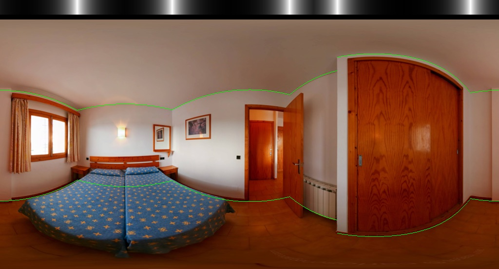

# How to prepare your dataset?

**TLDR;**
- Aligned images in `your_dataset/img/*.png` and ground truth in `your_dataset/label_cor/*.txt`
- Image in `1024 x 512` resolution
- Ground truth format:
    ```
    x_0 y_ceiling_0
    x_0 y_floor_0
    x_1 y_ceiling_1
    x_1 y_floor_1
    ...
    ```
    which follows the order of layout.

----

The dataset should be organized as below format for `train.py` to use it:
```
your_dataset/
|--img/
|  |--AAAA.png
|  |--BBBB.png
|  |--...
|--label_cor/
|  |--AAAA.txt
|  |--BBBB.txt
|  |--...
```

Please also note that:
- Your imaages should be aligned. If not, run `python preprocess.py --img_glob "your_dataset/rawimg/*png" --output_dir your_dataset/img --rgbonly`.
- All prefix names between images and grond truth should match. I.e if there is a `ASDF.png` in `your_dataset/img/` directory, there should be a `ASDF.txt` in `your_dataset/label_cor/`.
- All images have to be in the resolution of `1024 width x 512 height` for current implementation.
- Check your dataset is proper and ready for training by `python dataset.py --root_dir your_dataset/ --ith -1 --out_dir your_dataset/visualize`. Please check the ground truth visualization in `your_dataset/visualize` to make sure all thing go right.

### More notes about ground truth
- Each line of the txt is a corners in image coordinate (top-left is origin)
- x in range 0~1023
- y in range 0~511
- Format:
    ```
    x_0 y_ceiling_0
    x_0 y_floor_0
    x_1 y_ceiling_1
    x_1 y_floor_1
    ...
    ```
    - Odd lines are ceiling corners; even lines are floor corners.
    - Note that `x` values have NOT to be monotonically increasing but have to follow the order of layout (see below example).
- One example of image and ground truth pair:
    - ```
      158 186
      158 329
      353 185
      353 330
      594 154
      594 363
      713 100
      713 415
      692 77
      692 438
      965 150
      965 367
      ```
    - Please note that `713 100` and it floor correspondent `713 415` are occluded.
    - 
