# Results on Structured3D dataset

References:
- [Structured3D: A Large Photo-realistic Dataset for Structured 3D Modeling](https://arxiv.org/abs/1908.00222)
- [Structured3D project page](http://structured3d-dataset.org)
- [Structured3D github](https://github.com/bertjiazheng/Structured3D)

## Dataset preparation
- Please contact [Structured3D](http://structured3d-dataset.org) to get the datas.
- Download all zip files under `{YOUR_DIR}`. Don't extract them.
- Run below to extract rgb and layout with original furniture and lighting setting only:
    ```bash
    python misc/structured3d_extract_zip.py --zippath {YOUR_DIR}/Structured3D_0.zip --outdir {TARGET_DIR_EXTRACT}
    python misc/structured3d_extract_zip.py --zippath {YOUR_DIR}/Structured3D_1.zip --outdir {TARGET_DIR_EXTRACT}
    # ... for all Structured3D_?.zip
    ```
- Run below to create `data/st3d_[train|valid|test]_full_raw_light` following HorizonNet training and testing dataset format. (This will use soft link instead of copy a new one.)
    ```bash
    python misc/structured3d_prepare_dataset.py --in_root {TARGET_DIR_EXTRACT}
    ```

## Training
```bash
python train.py --train_root_dir data/st3d_train_full_raw_light/ --valid_root_dir data/st3d_valid_full_raw_light/ --id resnet50_rnn__st3d --lr 3e-4 --batch_size_train 24 --epochs 50
```
See `python train.py -h` or [README.md#training](https://github.com/sunset1995/HorizonNet#training) for more detail.

Download the trained model: [resnet50_rnn__st3d.pth](https://drive.google.com/open?id=16v1nhL9C2VZX-qQpikCsS6LiMJn3q6gO).
- Trained on Structured3D 18362 pano images with setting of original furniture and lighting.
- Trained for 50 epoch.
- Select 50th epoch according to loss function on validation set.

## Testing
Generating layout for testing set:
```bash
python inference.py --pth ckpt/resnet50_rnn__st3d.pth --img_glob "data/st3d_test_full_raw_light/img/*" --output_dir ./output/st3d/resnet50_rnn/ --visualize
```
- `--output_dir`: a directory you want to dump the extracted layout
- `--visualize`: visualize raw output (without post-processing) from HorizonNet.


## Quantitative evaluatation:
```bash
python eval_general.py --dt_glob "./output/st3d/resnet50_rnn/*json" --gt_glob "data/st3d_test_full_raw_light/label_cor/*"
```

:clipboard: Below is the quantitative result on Structured3D testing set.

| # of corners | instances | 3D IoU | 2D IoU |
| :----------: | :-------: | :----: | :----: |
| 4            | 1067      | `94.14`  | `95.50` |
| 6            | 290       | `90.34`  | `91.54` |
| 8            | 130       | `87.98`  | `89.43` |
| 10+          | 202       | `79.95`  | `81.10` |
| odd          | 4         | `88.62`  | `89.80` |
| overall      | 1693      | `91.31`  | `92.63` |

- The `odd` row mean non-even number of corners (ground truth is obviously non-manhattan layout while model output is the approximation of it)

#### Invalid Ground Truth
Four instances are skip by `eval_general.py` as the ground truth is self-intersecting. The top-down view of the four skipped instance are illutrated below where the red dot line are estimated by HorizonNet and the green solid line is the self-intersected ground truth.

| `scene_03327_315045` | `scene_03376_800900` | `scene_03399_337` | `scene_03478_2193` |
| :--: | :--: | :--: | :--: |
| 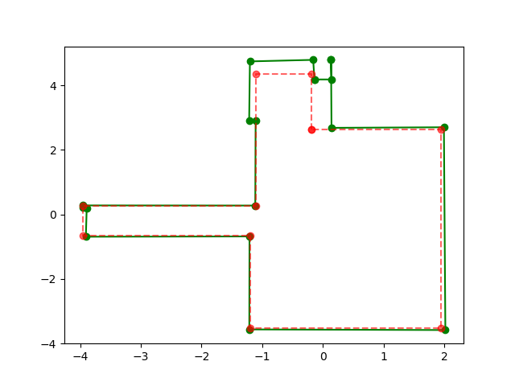 | 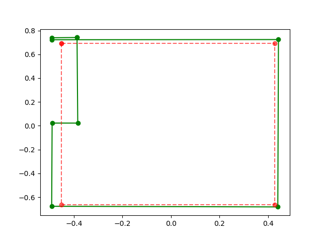 | 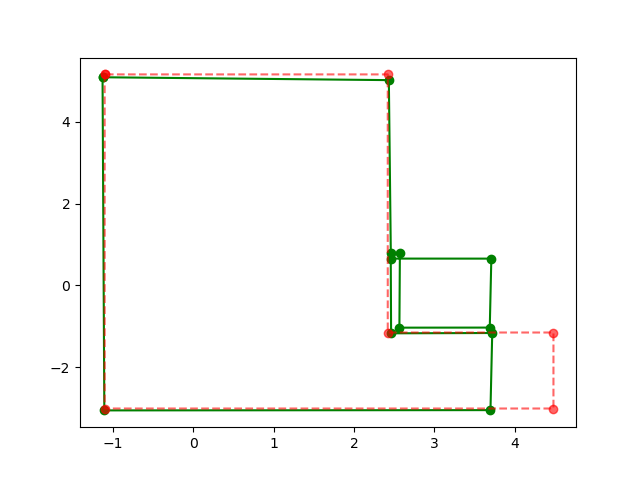 | 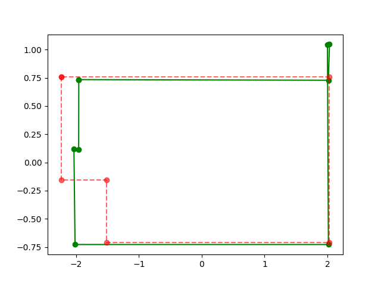 |

## Qualitative Results

##### From Structured3D testing set `scene_03300_[190736,190737,190738]`:
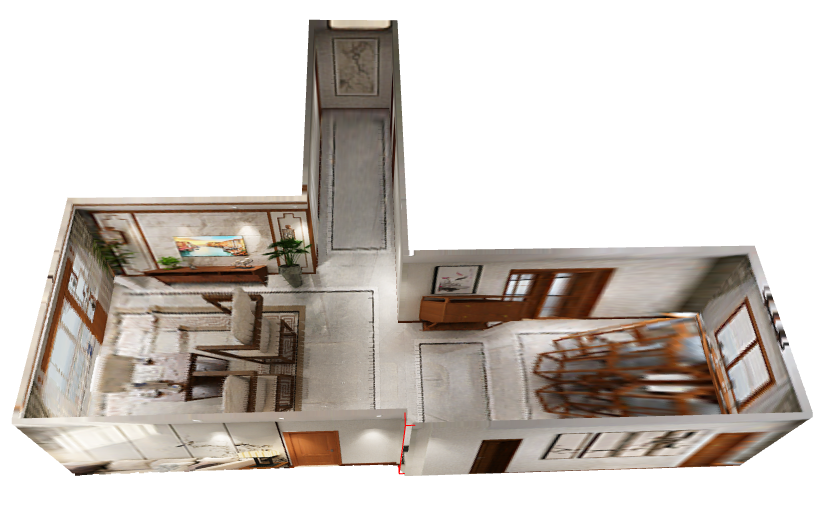
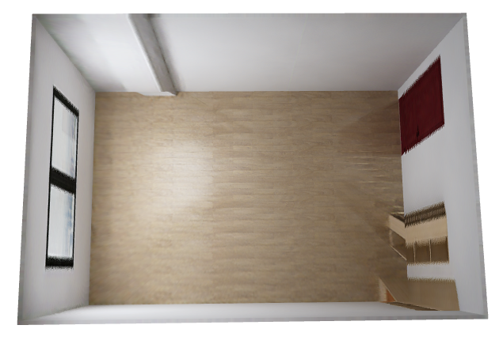
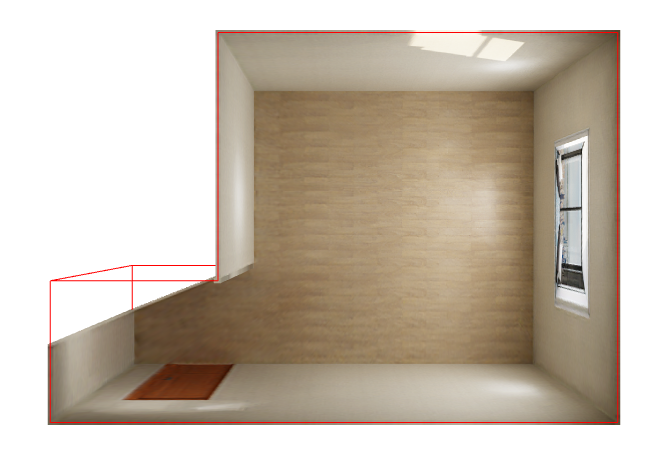

##### Model pretrained on Structured3D and directly testing on PanoContext:
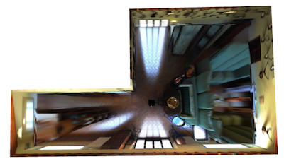
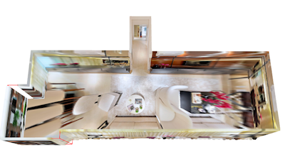
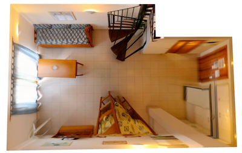
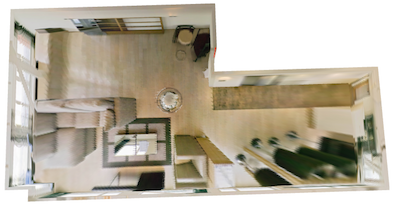
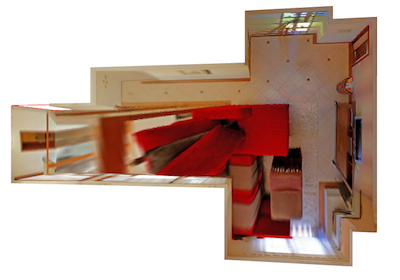
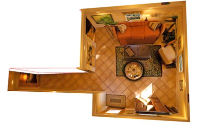
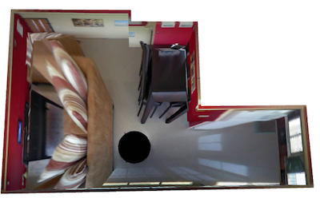
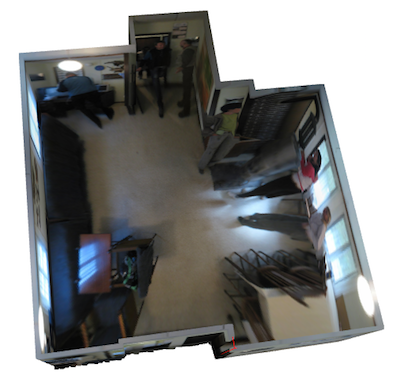
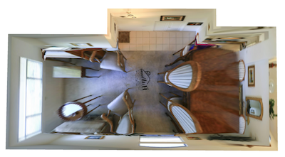
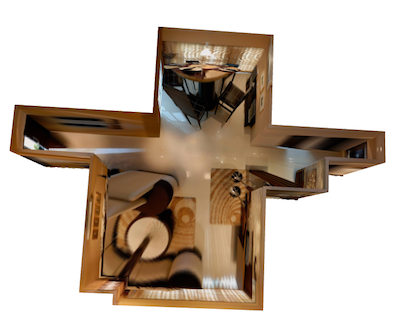
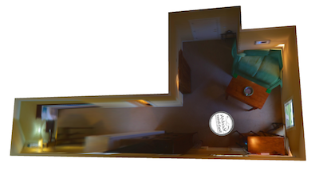
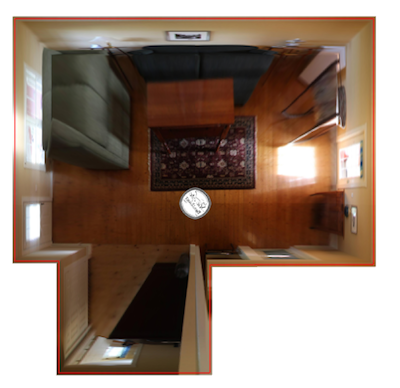

